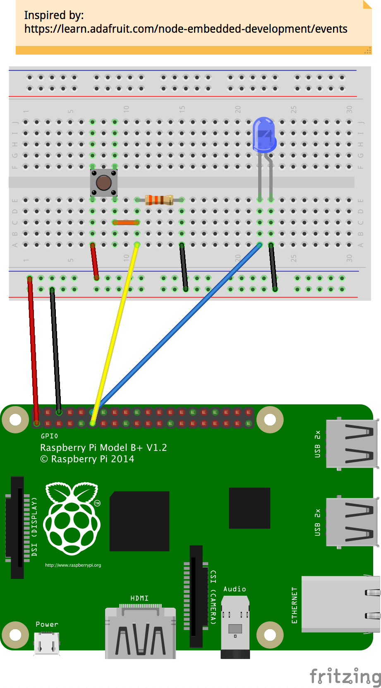
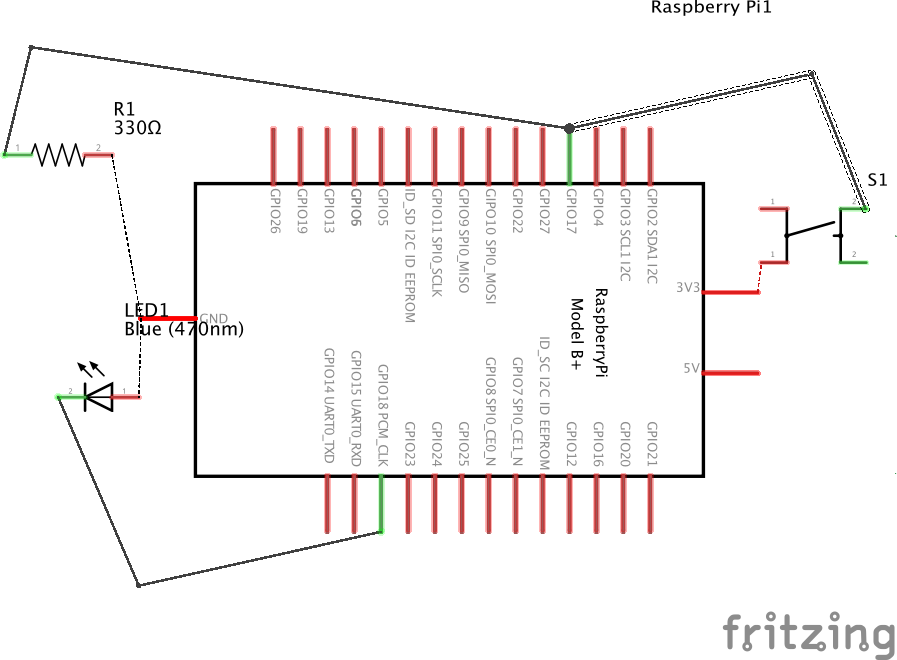

push-button-led
===============
Simple demonstration of getting Node.js working on the Raspberry Pi B. It uses the GPIO ports to accept input from a push button & writes to a LED.

This uses the [onoff](https://www.npmjs.com/package/onoff) package so make sure to run `npm install` after downloading.

*Actual designs found in `design.fzz`*

Breadboard Layout
-----------------

Schematic Layout
----------------
